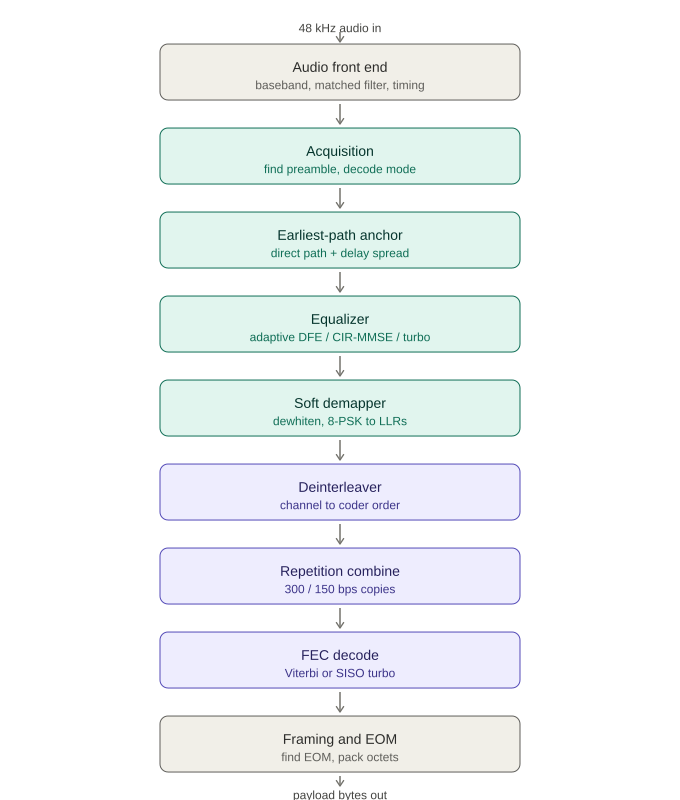

# Building a MIL-STD-188-110 HF Modem in Modern C++: An Introduction

**A weekly deep dive into a fixed-frequency serial-tone waveform, one block at a time.**

High-frequency (HF) radio is the communications system that refuses to die, and for good reason. It bounces signals off the ionosphere to reach thousands of miles with no satellites, no cell towers, and no infrastructure an adversary can switch off. That resilience is exactly why defense communications still standardize on it, and why **MIL-STD-188-110**, the interoperability standard for HF data modems, is still very much alive, from its 1991 "A" revision through the current "D."

Picture trying to pick out one friend's voice across a crowded room. Now make the room an echo chamber, so every word reaches you two or three times, each arriving a beat apart, and let the crowd swell and hush at random, so your friend fades to a whisper and back mid-sentence. That is the HF channel. And here's the part the textbooks written in the 1980s didn't have to reckon with: the room is louder now than it has ever been. The early radio pioneers listened into a quiet spectrum. We've filled ours with switch-mode power supplies, LED drivers, and phone chargers, each one humming broadband electrical hash across the very bands the ionosphere hands us for free. A modem that still works over *that* is a small master class in digital signal processing. Over the next several weeks I'm going to take mine apart, the **serial-tone (single-tone) waveform of MIL-STD-188-110A/B (110B §5.3.2)**, and walk through every block of it.

And there's a second reason it matters, the one that turns a clever demo into something you can actually field: the whole modem runs on a microcontroller, not a rack of specialized radio hardware. For the modern warfighter that's less about cost than about **weight and battery life**. A Cortex-M33 is a part you can put to sleep, so ours sits in deep sleep and only wakes when there's activity on the channel; the radio you carry gets lighter, lasts longer between charges, and still never misses a call. Resilient, low-power, and small enough to disappear into a handheld is a rare combination, and it's the one I care about most; I've spent my career in safety- and mission-critical codebases, the kind where a defect isn't a bug ticket, and this modem is that same rigor aimed at HF.

## The waveform in one breath

If the acronyms in this section aren't your world, don't sweat them; the single idea to carry out of it is that every one of them is a deliberate trade of raw speed for survivability.

The serial-tone body is deceptively simple on paper. Everything rides on a **single 1800 Hz carrier at 2400 symbols per second**, using **8-PSK** modulation, at data rates from **75 to 4800 bps**. Lower rates buy robustness by spending bits on redundancy: a **K=7 rate-1/2 convolutional code** protects the data, with symbol **repetition** at 300 and 150 bps and **Walsh** spreading at 75 bps. A block **interleaver** (0.6 s "short" or 4.8 s "long") scatters the bits so a fade burst damages many codewords a little instead of one codeword fatally. Known **probe** symbols are stitched into the data stream so the receiver can keep measuring the channel, and the whole burst opens with a **countdown preamble** that announces the mode and marks where the data begins.

That's the transmitter, and honestly it's the easy half. Encoding is deterministic. The hard half is undoing what the channel did.

## What a real receiver actually looks like

If you've seen the classic block diagram of this waveform, a clean left-to-right chain of equalizer to symbol extraction to deinterleave to Viterbi, you've seen an *honest simplification*. The standard even ships its own version (Figure 2, the serial-tone functional block diagram), and like every textbook rendering it assumes the receiver already knows where the burst starts and what mode it is. A real receiver has to earn all of that from raw audio and noise.

And that gap is the whole game. I've seen plenty of implementations that decode a clean, textbook waveform beautifully... and then fall over the moment the channel does anything real: a little noise, a fade, an echo, a few hertz of drift. The clean case is the easy ten percent. The hard ninety is the error correction, the equalization, and the timing and carrier tracking that keep a link alive when the ionosphere is working against you. Meeting the standard under those conditions is genuinely hard; exceeding it is harder still, and that's exactly what this series spends its time on.

The receive chain I built has nine stages, and the interesting ones are the three the textbook version glosses over:

- **Acquisition** doesn't assume sync; it *finds* the burst. It correlates against the known preamble in a way that survives fast fading, and decodes the mode and a countdown that tells a receiver waking up mid-preamble exactly how far ahead the data is.
- **Earliest-path anchoring** solves a subtle multipath trap: on a two-path channel you can lock onto the *echo* instead of the direct signal, which puts the real energy somewhere the equalizer can't reach. So I lock onto the direct path and treat the echo as energy the equalizer can *use*, not interference it can't.
- **The equalizer** is where my design diverges most from a reference model. Instead of one fixed adaptive filter, I pick the equalizer's geometry from the *measured* delay spread, and solve the channel one of three ways: an adaptive decision-feedback equalizer for the streaming/embedded path, a model-based CIR-MMSE equalizer that measures the channel and solves the optimal filter in one shot, and a whole-burst turbo decoder for the strongest possible decode. The insight behind it: a 20-symbol probe can't train a 46-tap adaptive filter on a fast-fading channel, but it easily over-determines a 13-tap channel *model*, so measuring the channel and solving the filter is the stronger move.

Everything after that carries *soft* information end to end: soft demapping to log-likelihood ratios, deinterleaving, repetition combining, and a continuous Viterbi (or a soft-in/soft-out decoder for the turbo loop). The decoder gets probabilities, not just hard guesses.

> **Does the extra machinery earn its keep? Here's the number.** Across every conformance corner the test plan defines for this waveform (Table 10.1 of the JITC conformance test plan, which verifies the 110B serial-tone performance requirements), my whole-burst turbo receiver decodes at **zero bit errors**, comfortably clearing a bar that only asks for fewer than one error in 100,000. That includes the punishing low-rate case of a 5-millisecond multipath echo under a 5 Hz fade, the condition the plan sets for 75, 150, and 300 bps. That worst-case corner is the one where two equal-strength copies of the signal arrive a beat apart and the channel breathes in and out five times a second; it's the corner that separates a demo from a modem. As one example of *why* it holds up: simply deciding to lock onto the **direct** signal instead of its louder echo cut the error rate roughly **tenfold** on a 300 bps two-path fading channel. Every figure in this series comes with its channel and SNR attached, because on HF a bit-error rate without a channel is a number without a meaning.

## Conformance is the floor, not the ceiling

Passing MIL-STD-188-110 is the price of admission; the interesting engineering lives in the *margin* above it. So I built a battery of my own tests that push well past what the standard asks: faster fading than the spec's worst corner, carrier offsets wider than it tolerates, and in-band interference it never contemplates at all. The modem holds zero errors across conditions the standard doesn't even test. That margin isn't a trophy; it's what keeps a link up when the real world is worse than the spec promised: more range on a bad night, messages that still get through under jamming and the electrical junk no test plan models. I'm not going to dump those numbers here; each one belongs with the block of the receiver that earns it, so I'll bring them out as we go and assemble the whole picture in the finale. But the headline is worth stating plainly up front: **meeting the standard was never the goal; beating it was.** That's a theme I'll keep coming back to.

## Why this is hard to fake: hours, not minutes

Here's what separates a real modem from a weekend project: endurance. Anyone can write something that decodes a clean 30-second test tone. The MIL-STD / JITC conformance regime doesn't ask for 30 seconds; it asks for *hours* of continuous, unbroken bitstream at a target error rate, over a channel that is actively fighting you the entire time. The plan isn't coy about the duration, either: it calls for each fading condition to be measured for at least **five hours**, and even the clean AWGN case for at least an hour. Just to *measure* a bit-error rate of 1 in 100,000 with statistical confidence you need on the order of ten million bits, and at these data rates that's a stream running for tens of minutes to hours without a single stumble.

A toy modem sails through the first few minutes and then quietly comes apart: a timing loop drifts, an accumulator overflows, a fade it can't ride knocks it off the channel. Passing means actually implementing the advanced DSP (adaptive equalization, carrier and symbol-timing tracking, interleaving deep enough to outlast a fade) that keeps the stream locked for the *full duration*. I found this out the hard way: a sample-index counter I'd kept in `float32` walks off the symbol grid after about twenty minutes of continuous audio (once it passes 2^26 samples, where the gap between representable integers grows past the step size). A two-minute test can never surface that. The hours-long soak isn't an inconvenience in the test plan; it *is* the test.

On top of duration, the channel itself escalates:

| Test channel | What it simulates | Why it's punishing |
|---|---|---|
| **AWGN (Gaussian)** | Thermal noise only, no fading | The baseline, yet the low rates must still decode at just a few dB of SNR |
| **Doppler shift / offset** | Radio tuning error, oscillator drift, ionospheric motion | Must hold sync with the carrier offset +/-75 Hz, and in the sweep test, ramping +/-75 Hz at 3.5 Hz/s |
| **Watterson 2 ms / 1 Hz** | Moderate two-path multipath, slow fade | Two signal copies ~5 symbols apart; the equalizer must exploit the echo, not fight it |
| **Watterson 5 ms / 5 Hz** | Severe multipath, *fast* fade (low-rate corner) | Echo 12 symbols deep *and* the channel changing 5x a second; the low rates (75-300 bps) must survive exactly this |
| **Continuous duration** (>=1 hr AWGN, >=5 hr fading) | A real operational link held open for hours | Every drift, overflow, and timing walk compounds over millions of symbols; only sustained DSP survives it |

## But it has to run on a microcontroller

There's one more constraint that shaped every decision you'll read about in this series, and it's worth naming up front: none of this was written just to run on a workstation. The whole modem cross-compiles to embedded microcontrollers, Cortex-M33 and M7-class parts, and that single rule, more than any other, is why the code looks the way it does. No heap in the signal path. No exceptions. One numeric type, chosen to match the hardware rather than habit.

That's an entire engineering philosophy of its own: the coding guidelines I hold myself to, why modern C++ is a genuinely capable choice for this kind of work, and how you get memory-safety-grade discipline without throwing away thirty years of tooling. It's too big to bury in an introduction, so it's where the series actually starts. Next week: the rules I build by.

## The series ahead

Each week I'll take one piece and go deep, looking at the DSP, the standard's intent, the failure modes on a bad channel, and the choices that keep it small enough to embed:

1. **The rules I build by.** The coding guidelines, no heap and no exceptions in the signal path, one numeric type, disciplined error handling, and what makes modern C++ the right tool for the job.
2. **The transmit chain.** Framing, the countdown preamble, and turning bits into an 1800 Hz waveform.
3. **The audio front end.** Matched filtering and Gardner symbol timing.
4. **Acquisition.** Finding a burst in noise, and reading the mode from a countdown.
5. **Earliest-path anchoring.** Why you lock onto the direct path, not the loudest one.
6. **The equalizer.** Adaptive vs. model-based, why measuring the channel beats chasing it, and what actually fits a microcontroller.
7. **Soft demapping and the FEC.** LLRs, continuous Viterbi, and the turbo loop.
8. **Orchestration.** The streaming state machine that makes it a live receiver.
9. **Testing and channel simulation** *(a side journey)*. Standing up the channel simulators (Watterson / PathSim), and how you get repeatable, statistically meaningful BER-vs-SNR results instead of a lucky decode. This one turned out complex enough to earn its own deep dive.
10. **Conclusion: the whole modem, measured.** The complete results table in one place: conformance, and everything the receiver does beyond what the standard asks.

If you build HF systems, write real-time C++, or just like watching a hard problem get taken apart cleanly, follow along.

---

*About the author.* Paul Decker (amateur radio callsign KG7HF) is a mission-critical, safety-critical embedded developer with thirty years of microcontroller experience, the greenfield kind, where a defect isn't a bug ticket. He served as a radioman aboard Trident ballistic-missile submarines, worked in the DSP division at Analog Devices, and has built safety-critical medical devices and mission-critical military systems. On the amateur side he's a dedicated homebrewer: antennas, amplifiers, and a long line of embedded controllers for ham gear. He works weak-signal VHF/UHF, including EME ("moonbounce"), and operates in the Army MARS (Military Auxiliary Radio System) program. He's an engineer and a builder, not an algorithm researcher: this modem isn't a research project, it's an engineered one, built to run on a microcontroller and proven against the standard.
