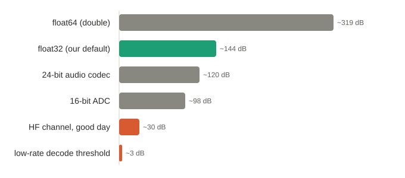

# The rules I build by

*New here? Start with the [overview](01-introduction.md).*

*Before the rules, a debt. These are not mine alone; they are the labor of a whole career, and every one of them was shaped by the engineers I have had the honor to work beside. Most of what I hold to here was taught to me, one code review and one hard-won bug and one patient explanation at a time. That is really the method, more than any single rule below: let your thinking evolve with every project and every review, keep what survives contact with the work, and let the rest go. They have changed as the standards and the tools changed, and they will keep changing. I set them down not as a decree but as what I have learned so far; if they are any good the credit is shared, and if they are still improving, that is rather the point. Special thanks to Brian, Jim, Erik, Patty, Dan, Glenn, Ken, and the many others I have worked beside over the years, who formulated and crafted these ideas with me.*

In the overview I said the whole modem has to run on a microcontroller, not just a workstation, and that one constraint shaped every line of it. This installment is that constraint, spelled out: the rules I hold myself to, and why I think they make the code both safer and faster than the C it is so often assumed to be slower than.

These aren't modem rules, or even embedded rules; I hold every project to them, and that consistency is the point. Apply the same discipline everywhere and two things compound. You get better at writing it right the first time, so the gap between "it works" and "it's right" keeps shrinking. And the reach-back gets cheap: that genuinely useful function you wrote eight months ago drops into the new project with far less rework, because it already speaks the same types, returns errors the same way, and owns nothing it shouldn't. Discipline you practice everywhere is discipline that pays you back.

Here is the shape of it before the detail, so you know where we are headed. One distinction sits under everything: **style**, which only ever costs you a confused maintainer, versus **functional** discipline, which is what actually keeps the program from failing. The embedded target then forces exactly three carve-outs from the language, and everything that remains organizes into four habits:

- **Memory and mutation, locked down.** No heap on the hot path, a bounded and knowable stack, `const` by default.
- **One type, top to bottom.** A single numeric scalar, almost no casts, and physical quantities that carry their units in their types.
- **Checked, not hoped.** Errors are values you cannot ignore, one way to fail everywhere, and as much proof as possible moved to compile time.
- **Less you have to trust.** No macros computing values, no shared mutable state in the core, the algorithms portable and the platform kept at the edges.

The claim underneath all of it, the one I want to earn over the rest of this piece, is that this is not the slow, careful C++ people brace for. Done this way it is both safer *and* faster than the C it is so often assumed to trail.

## Embedded-first, or nothing

Here's the constraint that shaped everything: this core must cross-compile to embedded microcontrollers, Cortex-M33 and M7-class parts, not just run on a workstation. If you've ever watched a single stray heap allocation blow a real-time audio deadline on a small ARM part, you already know why there is no `new` anywhere in my signal path. That one mandate rules out a mountain of the bloat that quietly accretes in DSP code, and it turns "good style" from a preference into a spec.

## The rules

Before any specific rule, one distinction that matters more than any single one of them: there are two kinds of "coding standard," and they fail in completely different ways.

The first is **style**, which is about human readability and nothing else: what you name a variable, a class, a function, a member; tabs or spaces; where a line wraps. A formatter like `astyle` enforces most of it, and a short style guide covers the rest. Get style wrong and nothing breaks; you've just left visual noise for whoever maintains the code next, which in mission-critical work is far more often than you write it. It matters, but it matters to people, not to the compiler.

The second is **functional**, and it's where the [C++ Core Guidelines](https://github.com/isocpp/CppCoreGuidelines/blob/master/CppCoreGuidelines.md) earn their keep: disciplined casting, strict types, honest error handling, DRY, `const` used liberally (const data, const pointers, or better still a reference), buffers that carry their length with their type (`std::array`, not a bare pointer and a separate size you hope still matches), scopes kept small, every object initialized before it's used, one name declared per line and only once you have a value for it. Get one of these wrong and the program can actually fail: a silent narrowing, an uninitialized read, a dangling reference, a buffer that lost track of its length. I follow almost all of them.

Almost, because the embedded target forces exactly three carve-outs, and all three are functional: **no exceptions, no RTTI, and no dynamic memory allocation** on the signal path. Everything else in the guidelines stands. So the build runs under `-fno-exceptions -fno-rtti`, warnings-as-errors, and in practice the functional rules look like this:

**Memory and mutation, locked down.**

- **No heap on the hot path.** Every buffer is a fixed `std::array` sized by a compile-time constant, its type and its length traveling together. The receiver allocates *nothing* while running; pools are prepared before the stream starts, and real-time callbacks never allocate, never block, never touch I/O.
- **Bounded, known stack; no unbounded recursion.** With the heap gone, the stack is the last place memory can surprise you, so recursion on the signal path is out and the depth stays bounded and knowable instead of a runtime unknown. I build with `-fstack-usage`, and every function in the core reports a fixed, compile-time frame; there are no variable-length arrays and no `alloca`, so nothing can grow the stack while the program runs. On a part with no MMU, a stack that can grow without limit is just a slower way to corrupt memory; I would rather know the worst case before the part ships than discover it in the field.
- **`const` by default, references over pointers.** Data is `const` unless it has a reason to change, and where a raw pointer would do I reach for a reference instead. Fewer things can move, so fewer things can go wrong.

```cpp
static constexpr std::size_t maximum_taps = 32U;
std::array<IQSample, maximum_taps> mCoefficients{};   // fixed size, zero-init, never allocates
```

**One type, top to bottom.**

- **One numeric type, chosen at build time.** The whole modem is parameterized on a single `Real` scalar: `float` by default, which already carries far more precision than the data ever has (the datasheet note below), with a seam already cut for a future fixed-point Q15/Q31 backed by the M33's CORDIC. Verification is by bit-exact golden vectors and an independent reference decoder, not by a higher-precision build; the point of one type is that nothing silently promotes or narrows between the layers.
- **One type all the way up and down, almost no casts.** Unify a call stack on one type and functions stop converting a size to call a helper that converts it back. Casts are where bugs hide (a silent narrowing, a signed/unsigned flip) and where the compiler stops being able to help you, and they are rarely free: an int-to-float conversion is a `VCVT`, a stray promotion to `double` is a software-emulated call on a part with no hardware double, and a few of those per sample, multiplied across a real-time block, is how a DSP loop quietly eats its cycle budget and misses its deadline. The only sanctioned cast is at the boundary of an API you don't own: the codec's `int16` buffer, a published C/DMA interface.
- **Strong types, not bare numbers.** A physical quantity carries its unit in its type: a `Frequency`, an `Angle`, a `Decibel`, a `SampleRate`, a `Baud`, a `BitRate`. You cannot build one or read it back without naming a unit, so a hertz cannot be mistaken for a kilohertz and a symbol rate cannot be passed where a bit rate belongs. The decibel types go a step further and know their own algebra: a gain adds to a power level, the difference of two power levels is a ratio, and adding two absolute power levels does not compile at all. It is the same instinct as the single `Real` type, taken up a level; make the wrong thing impossible to say, and let the compiler enforce the physics. And it is free at runtime: the wrappers fold away, so on the microcontroller a `Frequency` costs exactly what the bare number underneath it would.

```cpp
using Real = float;                  // the one scalar the whole modem is built on
Frequency carrier{1800, Hz};         // the unit lives in the type
Power     eirp = transmit + antenna; // dBW + dBi -> Power; but Power + Power will not compile
```

**Checked, not hoped.**

- **Errors are values, not surprises.** With exceptions off, a fallible operation returns a `[[nodiscard]] std::expected<T, Status>`, C++23's standard "a value, or the reason there isn't one," and exactly the shape the Core Guidelines' no-exceptions guidance describes (E.25 through E.28): you must handle it; you can't forget it, and you can't be ambushed by a throw three layers down. I mark the error type itself `[[nodiscard]]`, too, so even a bare status returned by value fails the build when it is dropped; forgetting to check an error is not a mistake you can make by accident, it is a mistake the compiler refuses to let you commit.

  One wrinkle earns its own sentence, because it is exactly where the no-exceptions rule and `std::expected` meet. With exceptions off, calling `.value()` on an error does not throw; it aborts, with no diagnostic and no `Status` left to inspect. So the fallible type is a thin `Result<T>` wrapped over `std::expected<T, Status>`: the storage is the standard type, but `value()` routes a missing value through an installable handler that can record the failure before it traps. It is one seam kept on purpose, for the one diagnostic the bare abort would have swallowed; everything else is just `std::expected`.

  In code the wrapper is small, and the whole design lives in one method:

```cpp
// A fallible T: std::expected<T, Status> underneath (standard, constexpr, trivially
// copyable when T is), wrapped for one reason. With exceptions off, std::expected's
// own value() on an error aborts, with no diagnostic and no Status to inspect.
template <typename T>
class [[nodiscard]] Result
{
public:
    constexpr Result(T value)  noexcept : mResult{std::move(value)} {}
    constexpr Result(Status e) noexcept : mResult{std::unexpected(std::move(e))} {}  // `return Status{...}` just works

    [[nodiscard]] constexpr explicit operator bool() const noexcept { return mResult.has_value(); }

    // Safe on success too, unlike std::expected::error(): a good result reports an ok Status.
    [[nodiscard]] constexpr Status error() const noexcept
    {
        return mResult.has_value() ? Status::success() : mResult.error();
    }

    // The one seam: a missing value routes through an installable handler that can record the
    // failure before it traps, instead of the blind abort. (The const& and && overloads mirror this.)
    [[nodiscard]] constexpr T& value() & noexcept
    {
        if (!mResult)
        {
            critical_error(mResult.error());
        }
        return *mResult;
    }

private:
    std::expected<T, Status> mResult;
};
```

  So where a signature above hands back `std::expected<T, Status>`, the shipped type is this `Result<T>`: the same value-or-error contract, drop-in with the standard type, plus the one trap the bare abort would have swallowed. The implicit `Result(Status)` constructor is what lets a function just `return Status{...}` on failure and `return value;` on success, with no ceremony at either end.
- **One way to fail, everywhere.** The single-type rule has an error-handling twin. If a function can fail it returns the one fallible type, a `Result<T>` (or a `Status` when there is no value to hand back), and nothing else; never a bare `bool` that secretly means "did it work," never a sentinel `-1` or `SIZE_MAX`, never a naked error code whose meaning the caller has to memorize. A `bool` gets exactly one job, a question the caller asks (`is_locked()`, `empty()`), never an answer about whether the last call survived. One channel means nobody learns a new failure convention per function: the way you check the channel estimate is the way you check the demodulator is the way you check the file open, a failure three layers down propagates up in the same shape, and the test is always `if (!result)` with the reason riding along. It is also a library's proper manners; the core originates failures and passes them up, it almost never inspects them, because deciding what an error means is the caller's job. That is why the error-code checks in this project cluster in the application that consumes the modem, not in the modem itself.
- **Compute at compile time, check at compile time.** Anything knowable before the program runs, a table, a size, a bit of geometry, is `constexpr`; the invariants that must hold, a buffer sized for the worst case, a type that must stay trivially copyable, a rate that divides evenly, are `static_assert`ed, so a wrong assumption fails the build instead of the mission. There are well over a hundred of these compile-time checks across the core, and every one of them costs nothing at runtime.

```cpp
[[nodiscard]] std::expected<ChannelEstimate, Status> estimate_flat_channel(...) noexcept;
static_assert(sizeof(Instance) <= 4096U);   // a wrong assumption fails the build, not the mission
```

**Less you have to trust.**

- **No macros for values or logic.** A constant is a `constexpr`, a set of states is an `enum class`, a small helper is an `inline` function or a template. A `#define` is text substitution with no type and no scope, and it bites where the debugger cannot follow it: the double evaluation, the silent narrowing, the name that collides with something three headers away. In the whole core the only macros are a platform export shim and a couple of build-time feature gates; nothing computes with them.
- **No shared mutable state in the core.** The portable algorithms are single-threaded on purpose. On a small part a mutex is expensive and there is no reason to be multi-threaded, so the core owns no interrupts, no timers, no DMA, and nothing two contexts can touch at once. The real-time handoff lives at the platform edge, and it stays simple: on the desktop side the audio is a plain producer-consumer relationship, one writer and one reader, not a web of shared locks. Concurrency bugs live in that seam, so I keep the seam thin and out of the algorithms.
- **Portable core, platform at the edges.** The algorithms know nothing of UI, OS, or drivers. The same source that runs a desktop diagnostic tool compiles into firmware.

```cpp
constexpr std::size_t maximum_taps = 32U;   // typed, scoped, and the debugger can see it
// not:  #define MAXIMUM_TAPS 32            // text substitution, no type, no scope
```

And none of it runs on the honor system. A formatter (`clang-format` or `astyle`) enforces the style half, so no one argues about names or indentation in review. `clang-tidy`'s `cppcoreguidelines`, `bugprone`, `performance`, and `modernize` checks enforce most of the functional half, run against the C++23 standard the project targets and wired into the build as an opt-in pass the CI and audit builds turn on; on Windows, Microsoft's C++ Core Guidelines Checker does the same job. A complexity checker (I use `lizard`, though `clang-tidy`'s cognitive-complexity check can do it in-build) guards against functions quietly growing unmaintainable: across the core the average function's cyclomatic complexity is under six, and the handful that run high are the genuinely hard DSP kernels, not accidents. No linter catches every guideline, and some rules are human judgment, but when I say I follow them it's a claim a machine re-checks, not something I'm asking you to take on faith.

The short version: get a name wrong and you've annoyed a maintainer; get one of these wrong and you've shipped a defect. Both are worth fixing, but only one of them fails at three in the morning, when a device is trying to read a life-saving sensor, or a radio is trying to get an emergency message out.

## A note on precision: read the datasheet

Developers reach for `double` by reflex, "double beats float beats int32," but almost none of them open the *datasheet of the part feeding them the numbers.* Your samples arrive from a codec or ADC with a hard precision ceiling, and the HF signal itself is buried near the channel noise floor. `float32` already carries far more precision than the data ever had, so `double` spends cycles and memory refining bits that are pure noise.



The one place `double` *does* earn its keep isn't per-sample math; it's a long-running accumulator, like the sample counter from the overview that walks off the grid after about twenty minutes of continuous audio. Match the precision to where the math actually needs it; the datasheet, not habit, tells you where that is.

That rule cuts the other way, too, and it caught me while I was writing this. My `Frequency` type stores its value in `double`, not the `float` the signal path runs on, and this time that is the right call: a frequency is not per-sample math, it is a setting, and it can be an on-air RF value. `float` holds integers exactly only to about 16.7 million, so a 29 MHz dial plus a one hertz nudge quietly rounds straight back to 29 MHz; the single hertz just vanishes. So the quantity that might live at RF gets `double`, while the sample stream that never needs it stays `float`, and each pays for exactly the precision it uses and no more. The wrapper also carries its own unit, so I can build one frequency in megahertz and another in kilohertz and add them without thinking; inside, both are only ever hertz. Same rule as the codec datasheet, pointed at my own types: match the precision to the quantity, not to a habit.

## Right and wrong, in the code

None of this is abstract. Here are four of the rules in real code, three of them straight from the modem's equalizer, next to the version I will not write, and the failure each one removes.

**Errors are values, and a buffer carries its own size.** The flat-channel estimate takes two spans, checks that they agree, and returns a checked result:

```cpp
[[nodiscard]] std::expected<ChannelEstimate, Status>
estimate_flat_channel(IQSampleSpan received_probes, IQSampleSpan known_probes) noexcept
{
    if (received_probes.empty() || received_probes.size() != known_probes.size())
    {
        return std::unexpected(Status{StatusCode::invalid_argument, "probe buffers are invalid"});
    }
    // ...
}
```

The version I refuse to write:

```cpp
// pointer + length: the caller can lie about either, and a bad input has nowhere to be reported
ChannelEstimate estimate_flat_channel(const IQSample* received, std::size_t n_recv,
                                      const IQSample* known,    std::size_t n_known);
```

Failure removed: the buffer overrun from a length that doesn't match its pointer; the caller who swaps `n_recv` and `n_known`; and the error with nowhere to go. A span carries its data and its length together, so they cannot disagree; the `[[nodiscard]] std::expected` makes the caller handle failure instead of dropping it; `noexcept` means the audio thread never unwinds. And if `std::span` looks like it copies the array on every call, it doesn't: it is just a pointer and a length passed by value, a view into memory the caller still owns, with member functions that keep every access inside the buffer. You get the safety of a bounds-checked container at the cost of passing two registers. And the pointer underneath is not a loophole: because the size rides along, a copy is written against `received_probes.size()`, so a size-aware copy (`std::ranges::copy` over the span, or `std::copy_n` bounded by `size()`) physically cannot walk off the end. Compare `memcpy(received, src, n)`, where `n` is a naked count that will cheerfully run past the buffer the moment it's wrong.

**Storage is fixed and initialized.** The filter taps are a compile-time-sized array, zero-initialized at the declaration:

```cpp
static constexpr std::size_t maximum_taps = 32U;
std::array<IQSample, maximum_taps> mCoefficients{};
```

The version I refuse to write:

```cpp
IQSample* coefficients = new IQSample[taps];   // heap on the hot path, uninitialized, and now someone must delete it
```

Failure removed: allocation failure, heap fragmentation, and the nondeterministic latency that blows a real-time deadline; the leak; and the uninitialized read. The `{}` starts every tap at a known value, and a fixed `std::array` never allocates and can't be freed out from under the receiver.

**One type, no casts.** The arithmetic stays in `IQSample` from end to end:

```cpp
// A conjugated correlation is an inner product. Use inner_product (a strict left-to-right
// fold), not std::reduce: reduce may reorder the sum, and float addition isn't associative,
// so its result is unspecified and not reproducible build-to-build; at a threshold it can
// even flip a decision. inner_product is deterministic.
const IQSample cross = std::inner_product(
    received_probes.begin(), received_probes.end(), known_probes.begin(),
    IQSample{}, std::plus<>{},
    [](IQSample r, IQSample k) { return r * std::conj(k); });
```

No raw index, so nothing to overrun and nothing for the bounds checker to flag; the intent ("correlate these two") is on the page instead of buried in a loop.

The version I refuse to write:

```cpp
double cross_re = 0.0, cross_im = 0.0;                              // accumulate in double...
for (std::size_t i = 0; i < n; ++i)
{
    cross_re += (double)received[i].real() * (double)known[i].real()
              + (double)received[i].imag() * (double)known[i].imag();
    cross_im += (double)received[i].imag() * (double)known[i].real()
              - (double)received[i].real() * (double)known[i].imag();
}
IQSample cross{ (float)cross_re, (float)cross_im };                 // ...then narrow it all back
```

Failure removed: the silent promotion to `double`, the narrow back to `float` on the last line, and every hand-rolled complex-arithmetic slip the standard library already gets right. And watch the cost. On a part with no hardware double, every `(double)` conversion and every `double` multiply and add is a software-emulated call, not a single FPU instruction. Drop that multiply-accumulate into a tight FFT butterfly and the per-iteration cost stops being one `VMLA` and becomes a fistful of emulated-double calls; across an N-point transform that is the difference between making your block deadline and an audio underrun. The one-type version compiles to single-precision `VMUL` and `VMLA` with nothing in between. When the whole stack speaks one type, there is nothing to cast, and nothing to pay for the cast.

**Units live in the type.** A quantity carries its unit, so the compiler speaks radio with you:

```cpp
using namespace modem::common;
using namespace modem::common::literals;

constexpr Frequency carrier     = 1800_Hz;     // not a naked 1800.0f
constexpr Baud      symbol_rate = 2400_baud;   // and not the same type as a bit rate

const Power tx   {10, dBW};     // an absolute power level
const Gain  amp  {13, dBi};     // a relative gain
const Power eirp = tx + amp;    // Power + Gain -> Power (amplification): 23 dBW

const Db snr = eirp - Power{-120, dBW};   // Power - Power -> a ratio in dB

const Power oops = tx + eirp;   // Power + Power: this line does not compile
```

Look at `tx + amp`. `tx` is in dBW, an absolute power level; `amp` is in dBi, an antenna gain. Those are different units, and adding them by hand is the sort of thing that should make you nervous. But a power level plus a gain is a new power level; that is what amplification is. So the result comes back a `Power`, in dBW, and I never carried the units in my head; the compiler did the dimensional bookkeeping. It is the difference between adding a temperature to a temperature change, which is fine, and adding two temperatures, which is not.

That last line is two absolute levels, and there is no meaningful sum of two power levels, the same way "nine o'clock plus noon" is not a time. So I made it impossible to write. The decibel type's `operator+` carries a constraint, `requires(!std::same_as<Tag, PowerTag>)`, so for an absolute `Power` it is not even a candidate; and I never wrote a free `Power + Power`. (I did write `Power - Power`, because the difference of two levels is a meaningful ratio, the `snr` line above.) Ask for the sum and the compiler looks for an `operator+` that takes two power levels, finds none, and stops. It is not an assert and not a runtime check; the program that does the wrong thing cannot be built. That is what C++20's `requires` clauses buy you: "this operation is not defined for this type" becomes something the compiler enforces.

Failure removed: the transposed unit, the hertz read as a kilohertz, the gain quietly added to a level as if they were the same thing, and the dimensionally meaningless operation that a comment would have let slide.

## A note on `void*`

There is one more cast worth calling out by name, because it hides so well: the `void*`. It almost never belongs in C++. A `void*` is not really a way to pass "anything"; it is a cast you have agreed to make later, at the far end, out of the compiler's sight. It throws the type away at exactly the point you most needed it, and the receiver buys it back with a `static_cast` the compiler cannot check. Hand that callback the wrong object and it still compiles, then does something undefined at runtime, far from the mistake. It also splits one idea into two things that must travel together and can silently disagree: a function pointer and its context. An interface binds the behavior and the object into a single typed thing that cannot be mismatched.

I caught myself on this while writing modem-core. One receiver's callback had grown up as a function pointer plus a `void* context`, the C way; most of the families still did it that way, and the easy move was to make the odd one out match the majority. I started to, then stopped and asked the question that mattered: do these C++ interfaces actually need `void*`? They did not. The C module contract is a separate, pure-C header with its own structs; the application links the C++ code directly, and no C caller could touch these interfaces anyway. So the alignment ran the other way. Every family moved *up* to a small typed interface, an abstract class with a couple of `noexcept` virtual calls, and the `void*` stayed only where real C lives. The casts disappeared because the type never got lost.

The "almost" is real, and it is narrow. `void*` earns its place at a genuine C boundary: the STM32 HAL, an RTOS like FreeRTOS, a Win32 or POSIX callback, or a frozen C ABI of your own. C has no templates and no virtual functions, so an opaque user-data pointer is simply the idiom there, and you make your peace with it. Even then you wrap it once, in one small adapter that does the single documented cast and hands typed references to everything behind it; exactly one place in the codebase ever sees the `void*`.

One caveat that is easy to miss on a microcontroller, because it is where I have watched good intentions backfire. Removing a `void*` only helps if what replaces it costs nothing. On a host you would reach for `std::function`; on a `-fno-exceptions`, no-heap signal path you cannot, because it allocates. The type-safe replacement has to be the zero-overhead kind: a template resolved at compile time, or a non-owning virtual interface, whose virtual call is a single indirect call, the very same instruction the function pointer was already costing you. Trade a `void*` for `std::function` and you have swapped a type hole for a heap allocation, which on the audio thread is the worse of the two. Avoid the `void*`, but reach for the tool that keeps the deadline, not the one that quietly breaks it.

## Turn it upside down

That decision about `void*` is worth one more look, not for the answer but for how it got there. The first instinct was to make the odd interface match the majority; the better answer only showed up when I stopped and asked the opposite question: what if I go the other way? What if the majority is the thing that's wrong? Aligning *up* instead of down was sitting right there the whole time, but I could not see it until I turned the problem over.

I learned that trick somewhere unexpected. I once took an art class, and I am genuinely terrible at drawing (most AI agents are no better, for what it's worth). The instructor, a real master, watched me struggle and gave me one piece of advice that has outlasted everything else from that room: turn the thing you are drawing upside down, and draw it upside down. Your brain stops insisting it already knows what a hand or a chair is *supposed* to look like, and you finally draw the lines that are actually there. Turn it sideways. Take the negative and draw the empty space instead of the object. What do you see now that you could not a moment ago?

Code review is the same discipline. The assumption you cannot see is the one doing the damage, and you do not dislodge it by staring harder from the same angle. So I keep asking "what if?" What if the data flowed the other direction? What if this owner should be the caller instead of the callee? What if the thing everyone treats as fixed is the one thing to change? Most of the time the answer comes back "no, the first way was right," and that is fine; you have paid a few minutes to be sure. But often enough the upside-down view shows you the line that was there all along, the one you would never have drawn facing the page the usual way.

## Determinism, or the same answer twice

Here is the hard one, the rule underneath the rules. For a system you have to verify, certify, and someday debug from a field failure, the same input must produce the same output: on this build, on the next run, and on a colleague's machine a year from now. Determinism is the precondition for proof. You cannot verify, trust, or certify a result you cannot reproduce.

That is why the `std::reduce` question earlier is not pedantry. Its result is unspecified: the standard lets it group the sum any way it likes, and because floating-point addition isn't associative, "any way it likes" can mean a different answer on a different day. The same trap hides in `-ffast-math`, which quietly reassociates your arithmetic; in relying on argument evaluation order; in reading uninitialized memory; in undefined behavior of any kind, a signed overflow, a shift off the end of a type, a strict-aliasing violation, each of which licenses the compiler to do literally anything, and "anything" is rarely the same thing twice; and in anything that depends on timing or thread scheduling. None of these are wrong the way a crash is wrong. They are worse: they pass every quick test and then diverge later, under a different compiler, a higher optimization level, or the one machine you can't get your hands on.

And it isn't only about ordering. The `float32` sample counter from earlier, the one that walks off the grid after twenty minutes, is the same disease in another form: same code, same input, correct and then incorrect, determinism lost across time rather than across runs. A two-minute test never sees it; a five-hour soak always does.

So determinism gets designed in, then proven. Designed in: one `Real` type so a build can't silently promote and shift the answer, a fixed left-to-right fold instead of a reordering reduce, no `-ffast-math`, every object initialized. Proven: bit-exact golden vectors and an independent reference decoder that has to produce the same bytes, checked on every build. The goldens aren't there because I doubt the math; they are there because "the same answer twice" is a property you can only keep by testing for it. Correctness you can often eyeball. Determinism you cannot, which is exactly why it's the one that bites in the field.

## "C++ is too slow": a myth worth retiring

There's a reflex in embedded circles that "C++ is too slow for a microcontroller." I'd put the opposite on the table: C++ written *this* way (templates resolved at compile time, no dynamic memory, no RTTI, no exceptions) is almost certainly **safer** than the equivalent hand-rolled C, and arguably just as **fast**, in a comparable memory footprint. The abstractions cost nothing at runtime because they're gone by the time the linker runs; what's left is the same machine code a careful C programmer would have written, but with the compiler enforcing the invariants instead of a code review hoping to catch them. Code that reads like a specification, runs in a few kilobytes of workspace, and doesn't make you choose between safety and speed. "Tight and fast" isn't a slogan; it's what the target demands.

## Honesty cuts both ways

Not every algorithm fits every part. The model-based CIR equalizer compiles *out entirely* on embedded targets to reclaim ~14 KiB, and the whole-burst turbo decoder that earns the standard's conformance corners at zero errors is a host-side path; on the microcontroller, the leaner adaptive decision-feedback equalizer is the sole receiver, a decision expressed in one build flag rather than a forked codebase. That's a real tradeoff, not a free lunch: the embedded receiver gives up some of the turbo path's fading margin to fit the part's memory and clock budget. But the ceiling there is *this particular part's* budget, not embedded computing itself; every processor has a ceiling, and a bigger part or a co-processor moves it. I'll quantify what the tradeoff costs, and whether more capable hardware (a larger part, or the FPGA co-processor I've prototyped alongside the M33) buys the turbo path back into budget, when I reach the equalizer.

## A word on "safety"

There have been press conferences and position statements arguing that one language is inherently safer than another. The fact is quieter: safety is far more about using the tool correctly than about which tool you picked. That framing confuses the tool with the hand holding it. A language isn't unsafe on its own; code becomes unsafe through undisciplined practice: the raw pointer no one bounds-checked, the buffer no one sized, the exception no one expected. The guardrails are right there in the language; unsafe code comes from engineers who don't use them, or who deliberately switch them off. A power saw hurts you when the operator won't lower the guard into place; the saw isn't the defect, the choice is. The disciplines I hold to in this project (no heap in the signal path, checked `[[nodiscard]]` results instead of surprises, one unified type, casts only at the door) are those guardrails, used on purpose. And modern C++ hands you the rest directly: `std::span` and `std::ranges` for bounds-safe access instead of raw pointer arithmetic, `std::array` for fixed storage, and RAII with `std::unique_ptr` for ownership you cannot leak. C++23 is a perfectly capable language for safety- and mission-critical work; you just have to pick up the tools it already gives you. The safe choice isn't a rewrite; it's the practice.

## On the rulebooks: MISRA, AUTOSAR, JSF

Someone in a regulated shop is already asking the obvious question: where is MISRA? This is medical and military work, and MISRA C++ (now MISRA C++:2023), AUTOSAR C++14, and JSF are the coding standards certification bodies ask for by name. I have been pointing at the C++ Core Guidelines instead.

Here is my honest position. Write code the way I am describing, and use the Core Guidelines the way they are meant to be used, as a way of thinking and not a checklist, and you are not falling short of those rulebooks; you are past them. The rules in this article are stricter than most of what those standards enforce, and having clang-tidy and lizard check them on every build is a stronger guarantee than a signature attesting that someone read the standard once. A result a machine re-derives on every commit beats a box a human ticked at the end.

I will go further, because I have watched it happen. A great deal of "MISRA-compliant" code is not compliant in spirit at all; it is a pile of suppressed warnings and blanket deviations. The rule fires, the deadline is close, and the fastest way to green is a justification comment and a suppression, not a fix. The standard is satisfied on paper while the very thing it warned about stays in the code. That is the failure mode of any rulebook used as a checklist: it rewards making the warning disappear, not making the defect disappear.

My rules push the other way. When the analyzer flags something, the move is to change the code until the reason for the warning is gone, not to annotate it into silence. Address the root cause and the deviation log stays short and honest. The goal was never to satisfy a document; it was to make a class of failure impossible. Do that in earnest and the certificate takes care of itself.

## A note on getting it wrong

I should be honest about all of this: I don't always get it right the first time. I slip back into old habits, I race to get something working, and then I look up and find a raw index where a span belongs, or a function that quietly grew three jobs while I wasn't watching. The rules above are not how my first draft comes out. They are what I hold myself to on the way from "it works" to "it's right."

Code is iterative, like anything worth doing. You can absolutely write software this way, anyone can, but not in one pass and not on good intentions alone. It takes real work, real time, and honest iteration: write it, measure it, run the linter over your own code, and fix what it finds. That last part is the whole point of the tools; they catch me when I've slipped, they are not a trophy for never slipping. The discipline isn't being perfect. It's going back.

## Why this is what "safety-critical" means

Step back from the individual rules and the argument is simple. "Mission-critical" and "safety-critical" are not adjectives you earn by trying hard; they are a standard of evidence. The question is never "is the code good," it's "can you show that a whole class of failure cannot happen." Everything above exists to answer that question, one failure mode at a time.

Read the rules in that light and they stop being style. No heap on the signal path removes allocation failure, fragmentation, and the nondeterministic latency that blows a real-time deadline. No exceptions removes an invisible control path through code that must never unwind on the audio thread. Checked results, in an error type you cannot silently drop, remove the error a caller forgot to handle. One type, with casts only at the door, removes the silent narrowing and the signed/unsigned slip; a quantity that carries its unit removes the unit mismatch and the transposed argument. A `std::array` that carries its length removes the buffer overrun; a bounded, recursion-free stack removes the silent overflow on a part with no memory protection; initializing every object removes the uninitialized read; a `static_assert` removes the wrong assumption that would otherwise wait until runtime to matter; small, low-complexity functions remove the path no test ever covered. Each rule turns a possible defect into an impossible one, at compile time or by construction. That is the whole game: you don't hope the bug isn't there, you arrange for it to be unrepresentable.

And then you prove it, which is where the tooling stops being a convenience and becomes the point. A safety process does not accept "we were careful"; it wants a demonstration it can repeat. The compiler's warnings-as-errors gate every build, and clang-format, clang-tidy, and lizard run as a build-integrated pass, so the discipline isn't a story I tell in a design review, it's a result a machine reproduces. Careful is a feeling; a failing build is a fact.

That is why disciplined modern C++ belongs in mission-critical systems, and why I keep the rules boring and the tools honest. The exciting part is the DSP. The rules are what let me sleep while the modem runs for five hours straight.

## Next

With the rules on the table, next week I start at the top of the signal chain: the transmit side, the easy half done right.
