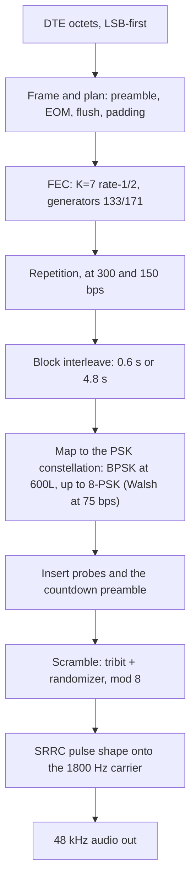

# The transmit chain: the easy half, done right

*Part 2 of "Building a MIL-STD-188-110 HF Modem in Modern C++." Start with the [overview](01-introduction.md), or Part 1, [the rules I build by](02-embedded-cpp-philosophy.md). The code for this article is on GitHub: [kg7hf/modem-core](https://github.com/kg7hf/modem-core/tree/part-2).*

At the end of Part 1 I called the transmitter the easy half. Encoding is deterministic, there is no channel to undo, and the standard spells out every step. I still hold it to the same discipline as the receiver.

A transmitter error can pass every test you run. Get one bit order backwards, seed a scrambler one tap wrong, or number the interleaver rows the way that felt natural instead of the way the standard wrote them, and the waveform still looks fine on a scope and still decodes perfectly... in your own receiver, which makes the same mistake. Only another vendor's modem shows the error, and by then it is on the air.

The best-known case of this kind of error is NASA's Mars Climate Orbiter. The interface specification called for thruster impulse in newton-seconds, but the contractor's ground software wrote it in pound-force seconds, and NASA's navigation software read those numbers as newton-seconds. Each program was consistent with itself; the mismatch showed only where the two met, and in 1999 the spacecraft was lost as it arrived at Mars. Part 1's unit types catch that kind of mismatch inside one program. Between two programs built by different teams, the specification is the only shared reference, so on the transmit side I follow it exactly, not my instincts.

The transmitter is also the reference for everything that follows. The whole receiver, all nine stages, is tested against output from this side; the golden vectors that gate every build are transmit output, decoded and compared. A subtle transmitter error would carry into every receiver result measured against it.

Here's a story from my childhood. When I was very young, my dad had a professional furniture repair shop. One day I was at his shop causing kid trouble, and he had had enough, so he wanted me to cut some wire to a specific length. He cut the first one, then showed me how to measure the next one with it; I was likely so young I couldn't even read a measuring tool. So piece by piece I cut, measured with the last one I cut, cut again, measured with the last one I cut... The astute reader can see where this is going. After some time, the wires I was cutting were getting longer and longer each time; little by little they were drifting, because of cumulative measurement errors, until I had pieces that were extraordinarily long.

Each piece was measured against the one before it, so each small error carried into the next and added up. That is why the transmitter has golden tests: every build is checked against the same saved snapshot of its output, so errors cannot add up from one build to the next.

The chain takes a few user bytes to an 1800 Hz waveform. It is linear, each stage feeding the next with no feedback, which is the other reason it is the easy half.



The waveform is a family of modes, from 75 bps to 4800 bps. They share this chain and differ mainly in how much redundancy they add. I follow one mode the whole way down: **600 bps with the long interleaver, "600L."** It is the mode I use most: slow enough to survive a rough NVIS path, fast enough for real traffic, and coded and interleaved enough to exercise every stage of the chain. Where another rate does something different, the 75 bps Walsh mode above all, I say so. I take it a stage at a time, then walk a two-character message through the whole chain in 600L.

## Plan the whole burst before you move a bit

Part 1's first rule was no heap on the hot path: the signal path allocates nothing while it runs. So the transmitter does all of its sizing up front. Before a single bit is encoded, `body_transmission_plan` sizes the entire transmission: the countdown preamble, the coded body blocks, the end-of-message marker, the coder flush, and the padding that squares off the final interleaver matrix. It returns a plan, not a buffer.

```cpp
struct BodyTransmissionPlan
{
    BodyBlockPlan block{};
    std::size_t    payload_bits{};
    std::size_t    framed_bits{};
    std::size_t    body_blocks{};
    std::size_t    preamble_symbols{};
    std::size_t    transmitted_symbols{};
    std::size_t    audio_samples{};
};

[[nodiscard]] Result<BodyTransmissionPlan>
body_transmission_plan(BodyMode mode, std::size_t payload_bytes) noexcept;
```

The render step then takes that plan, the payload, and a `BodyTransmissionScratch` of caller-owned work buffers, and writes the audio without touching the heap:

```cpp
[[nodiscard]] Status
generate_body_transmission_audio(const BodyTransmissionPlan& plan,
                                 std::span<const std::uint8_t> payload,
                                 BodyTransmissionScratch scratch,
                                 MutableSampleSpan audio) noexcept;
```

Every buffer the pipeline needs (the framed bits, the coded bits, the interleaver matrix, the interleaved bits, the transmitted tribits) is a span the caller prepared, sized from the plan. On a microcontroller, that is what lets you prove the transmit path never runs out of memory. Errors are Part 1's error values: a request the plan cannot size comes back as a failed `Result`, and buffers that do not match the plan come back from the render as a `Status`, both before any audio is written.

## The FEC: spend bits to buy survival

After framing comes forward error correction: the modem adds redundant bits so the receiver can correct errors. The serial-tone body uses a **K=7, rate-1/2 convolutional code**, the classic NASA-heritage code with generator polynomials **133 and 171 in octal**. Rate 1/2 means every input bit produces two coded bits; K=7 means the encoder remembers six previous bits, so each output depends on the last seven inputs. That overlap lets a decoder correct errors that a code without memory could not.

In code the encoder is a tiny state machine. You push one bit and get back the pair of coded bits it produced, T1 then T2, which is the order the standard serializes them and the order the receiver has to expect:

```cpp
struct EncodedPair { std::uint8_t t1{}; std::uint8_t t2{}; };

class ConvolutionalEncoderK7
{
public:
    explicit constexpr ConvolutionalEncoderK7(std::uint8_t initial_state = 0U) noexcept;
    [[nodiscard]] EncodedPair push(std::uint8_t bit) noexcept;   // generators 133/171 octal
    // ...
};
```

The T1-before-T2 order has to match on both ends, so it is documented in the encoder's source, and the golden test, which checks every transmitted symbol against a saved snapshot, fails if the order ever flips. The lower rates add more redundancy on top of the code, which is the next stage.

## Repetition and Walsh: more redundancy, lower rates

The rate-1/2 code alone carries 600, 1200, or 2400 bits per second of user data over the 2400 symbol-per-second channel, depending on how many bits each symbol carries. The lower rates add repetition. At 300 and 150 bps the coded bits are repeated, so the receiver can combine several noisy copies into one decision; the encoder provides this as `encode_repeated_pairs`. At 75 bps the modem switches to **Walsh orthogonal spreading**, giving up almost all of its throughput for a signal that survives conditions the coded rates cannot. At the top, 4800 bps is uncoded: no convolutional code at all, so it has no error protection and depends entirely on the equalizer. (The tail-biting punctured variant you will also find in the encoder belongs to the 110B high-rate waveforms, a different family.) So the mode selects one of four options: the plain code, repetition, Walsh spreading, or no code.

## Interleaving: scatter the damage

Fades on HF are bursty. A 200 ms null wipes out a long run of consecutive bits, more than the code can correct. So between coding and modulation a block interleaver scatters the bits in time: a **0.6 second "short"** matrix or a **4.8 second "long"** one. The coded bits are written into the matrix one way and read out another, so bits that were neighbors in the code end up spread across the interleaver span on the air. A fade then damages a few bits in many places instead of a long run in one place, and the code corrects scattered errors well. The longer the span, the longer the fade it can break up. The cost is latency: 4.8 seconds for the long interleaver.

## Bits to symbols: the constellation and a Gray map

Next the coded bits become points on the constellation. Every mode sends **2400 symbols per second on the same 1800 Hz carrier**; the data rate changes how many bits each symbol carries. The fast modes use the full **8-PSK** circle, three bits per symbol; 1200 bps uses QPSK, two bits; and **600L uses BPSK, one bit per symbol**, two points on opposite sides of the circle. Fewer points sit farther apart, so it takes more noise to turn one into another.

The mapping from bits to phase is Gray-coded on purpose: adjacent constellation points differ by exactly one bit, so when noise nudges a symbol into its neighbor, the receiver's most likely error, only one bit flips instead of several. All of it comes from one shared function, `modified_gray_decode`, read the same way by the transmitter and both demappers, with a small table for each width:

```cpp
// MIL-STD-188-110B body-waveform modified-Gray mapping.
// width 3 (8-PSK): the full table.  width 1 (BPSK, 600L): bit 0 -> 0, bit 1 -> 4.
constexpr std::array<std::uint8_t, 8> map{0U, 1U, 3U, 2U, 7U, 6U, 4U, 5U};
```

So in 600L a coded 0 becomes tribit 0, the point at 0 degrees, and a coded 1 becomes tribit 4, the point at 180 degrees. A mistake in this mapping goes out on the air, so the table lives in one place instead of being retyped wherever a symbol is formed, and a `static_assert` locks its derived cases.

(The 75 bps mode is the exception: instead of mapping coded bits to single symbols, it sends each pair of coded bits as a 32-symbol Walsh sequence. It rejoins the chain at the scrambler.)

## Probes and the countdown preamble

A receiver cannot equalize a channel it cannot measure, so the transmitter inserts known symbols into the stream. These **probe** symbols are values the receiver can predict exactly; it uses them to keep estimating the channel as it changes. The equalizer, in a later article, depends on them.

And the whole burst opens with the **countdown preamble**. It does two jobs. It announces the mode, so a receiver that had no idea what was coming learns the rate, the interleaver length, everything it needs to configure itself. And it counts down to the data, so a receiver that wakes up in the middle of the preamble, which on a low-power part listening for activity is the normal case, knows exactly how many symbols remain until the payload begins. That countdown is what lets the Cortex-M33 from the overview sleep through dead air and still catch the start of a message. Finding the preamble in noise is the receiver's job, in Part 4.

## Scrambling: whiten it, and exactly

The last step before the carrier is the scrambler, and it has to match the standard exactly. Long runs of identical symbols are bad for a receiver's timing and carrier recovery and bad for the transmitter's spectrum, so the modem adds a known pseudo-random sequence to whiten them. By now the data is tribits on an 8-PSK ring, so the scramble is modular addition on the ring, not an exclusive-or:

```cpp
// (tribit + randomizer) mod 8, on the 8-PSK ring
[[nodiscard]] constexpr std::uint8_t tribit_add(unsigned tribit, unsigned randomizer) noexcept
{
    return low_bits<3>(tribit + randomizer);
}
```

The randomizer itself is a linear-feedback shift register (`BodyDataRandomizer`), and it whitens every body symbol, data and probes alike; the preamble gets its own fixed sequence (`SyncRandomizer`), the one the receiver correlates against. Every part of the system that has to agree on these sequences, the transmit mapper, the probe generator, the receiver's reference, adds the randomizer the same way through this one function. That is DRY, from Part 1's list, applied to the standard: there is exactly one definition of adding the randomizer, so the transmitter and the receiver cannot disagree about it.

## Turning symbols into 1800 Hz

Pulse shaping and modulation are the only real signal processing on the transmit side. Each symbol, whichever part of the constellation the rate uses, is a phase on a single **1800 Hz carrier**, at **2400 symbols per second**. To keep it from splattering into the neighboring spectrum, each symbol is shaped with a **square-root raised-cosine** pulse; the receiver filters with the same family of pulse. The carrier itself is a phase that advances a fixed step per sample:

```cpp
// Carrier phase advance per sample: (two_pi * f) / fs, in Real, in the shipped order.
template <HertzSource F> [[nodiscard]] constexpr Real radians_per_sample(F carrier, SampleRate sample_rate) noexcept
{
    return two_pi * static_cast<Real>(carrier.hertz()) / sample_rate.hertz_real();
}

// The carrier-step check: the exact float the shipped code produced for the body carrier.
static_assert(std::bit_cast<std::uint32_t>(radians_per_sample(Frequency{1800.0, Hz}, SampleRate{48000U})) == 0x3E714639U);
```

Several of Part 1's rules show up in that one return statement. The carrier and the sample rate are unit types, not bare numbers, so passing a sample rate where the carrier belongs does not compile. The arithmetic stays in the single `Real` type, so nothing promotes to a software-emulated double on the M33. The operation order is fixed, `two_pi * f` then divide, so the value is bit-for-bit the same on every build, and the `static_assert` locks that float to its bit pattern at compile time. Every sample the transmitter emits uses this step, so a one-bit change here changes the whole waveform. The modulator renders straight into the caller's audio span without allocating, so the same code can write a WAV file on a PC or feed a DAC on the microcontroller.

## Walk a message through it

Here is the two-character message "Hi" pushed through the chain in 600L. Every value below is what the code actually produces, not an illustration; I ran the real encoder and modulator stages and copied the numbers out, and `tx_demo` in the repository prints the bit-level ones.

The transmitter takes user octets **least-significant bit first**. The byte for 'H' is 0x48, so it enters the encoder as the bit sequence:

```
'H' = 0x48 -> 0 0 0 1 0 0 1 0
```

Those bits feed the K=7 encoder one at a time, and each one comes back as a coded pair, t1 then t2. Starting from the all-zero state, the eight bits of 'H' produce:

```
input bit:  0    0    0    1    0    0    1    0
coded pair: 00   00   00   11   01   11   00   01
```

Look at the fourth column. The input bit there is the first 1 in 'H', and both coded bits change. The encoder's memory then affects the pairs after it, even where the inputs are 0 again. Each input bit influences seven coded pairs, fourteen coded bits, which is what lets the receiver recover it after the channel corrupts some of them.

Because 600L is BPSK, each coded bit becomes one symbol on its own; there is no gathering into threes. A coded 0 maps to tribit 0 and a coded 1 maps to tribit 4, the two points at 0 and 180 degrees:

```
coded bit 0 -> tribit 0  (0 degrees)
coded bit 1 -> tribit 4  (180 degrees)
```

Interleaving sits between the code and this mapping, and it is the one stage a single-message trace cannot really show on paper: it scatters the coded bits across the whole 4.8 s long-interleaver span, so two bits that were neighbors above end up hundreds of milliseconds apart on the air, and a fade that would have wiped out a run of them instead leaves isolated errors scattered across the codeword.

Last, the scrambler adds its known sequence on the ring before the symbol reaches the carrier. The body randomizer's first tribits are:

```
0  2  4  3  3  6 ...
```

Take a coded 1: it maps to tribit 4, and with a randomizer value of 2 it becomes `(4 + 2) mod 8 = 6`. That is the tribit that goes out on the air, at `6 x 45 = 270` degrees. BPSK only produces tribit 0 or 4, two phases, but after the randomizer is added the transmitted symbols land on all eight, so the spectrum looks full and random even though the data is two-level. The receiver runs the same randomizer, subtracts the same 2, recovers tribit 4, and reads it as a 1. The sequence is known to both ends; it only looks random on the air.

The transmitted tribit is a phase. The modulator turns tribit 6 into a point on the 8-PSK circle, `psk8_symbol(6)`, the unit vector at `6 x 45 = 270` degrees:

```
tribit 6 -> I = cos(270) = 0.000,  Q = sin(270) = -1.000   (magnitude 1)
```

Then the point modulates the carrier. Each output sample advances the carrier phase by the fixed step the `static_assert` locks, `2*pi*1800/48000 = 0.2356194` radians, which is 13.5 degrees per sample; at 48 kHz one full cycle of the 1800 Hz tone is about 26.7 samples, and each symbol occupies 20 of them. The audio sample is the real part of the symbol rotated by that phase, scaled for headroom:

```
audio[n] = scale * Re{ symbol * exp(j * carrier_phase[n]) }
```

To see it, hold tribit 6 steady and the modulator emits a clean 1800 Hz sinusoid sitting at that 270-degree offset. These are eight consecutive samples the modem actually produces, climbing to a crest and turning over:

```
n=241  n=242  n=243  n=244  n=245  n=246  n=247  n=248
0.126  0.244  0.349  0.435  0.497  0.531  0.536  0.511
```

That is the 1800 Hz carrier, one sample every 13.5 degrees, with its amplitude kept under the `0.98` no-clip limit the modulator derives from its own pulse. In live traffic the phase changes every 20 samples as the tribits change (for 600L the data only ever picks tribit 0 or tribit 4, and the randomizer spreads those picks across all eight phases), and the square-root raised-cosine pulse smooths each change so the burst stays inside its band.

Every value here is deterministic, reproducible, and defined in exactly one place, so a receiver that does each step in reverse, mine or an independent one, gets back the bytes "Hi".

## Why the easy half gets the same rigor

The transmit chain is short: plan, encode, repeat, interleave, map or spread, probe, scramble, shape. None of it is hard the way undoing a fading channel is hard. But at every stage a detail the standard fixes can be subtly wrong in a way that testing against your own receiver never reveals, because your receiver shares the mistake. So I treat the transmitter as ground truth. Its output is the reference the whole receiver is measured against, and it is what an independent implementation has to decode. It has to be exactly right for anyone else to talk to you, which means building it once, carefully, from the specification, and keeping it from drifting.

## Go read the code, and the standard

The core skill in this work is reading a specification and confirming that the code does what it says. The code is on GitHub at [kg7hf/modem-core](https://github.com/kg7hf/modem-core/tree/part-2), and its [start-here page](https://github.com/kg7hf/modem-core/blob/part-2/docs/start-here.md) maps it stage by stage. MIL-STD-188-110 is public (pull it from EverySpec or the DoD's ASSIST site). It is written in "shall" statements, with the exact numbers in its tables and figures. Several of the questions below have you open the standard and the source side by side, find a requirement, and check that the code meets it. That is most of the daily work in mission-critical engineering.

1. What carrier frequency and symbol rate does this waveform use, and where are they set? One search; they are named constants, not magic numbers.
2. The standard gives the K=7 code's generator polynomials in **octal**: 133 and 171. The code stores them as `0x6D` and `0x4F`. Convert 133 and 171 to hex yourself; you will get `0x5B` and `0x79`, which do *not* match. Work out what the code did, and why. (Which end of the shift register feeds the taps?)
3. The end-of-message marker is a specific 32-bit word. Find it in the code (a single hex literal), then find where the standard specifies it, and check it bit for bit. Why would a wrong EOM word pass every one of your own tests and only surface when another vendor's modem reads your signal?
4. The body data randomizer is a 12-bit shift register. MIL-STD-188-110B Figure 6 draws it, including the value it is loaded with at the start of every burst; the code even cites the page. Find the initial load in the code and confirm it against the figure. (Write `0xBAD` in binary and compare it with the figure.)
5. The 8-PSK modified-Gray mapping is a table in the standard (MIL-STD-188-110B section 5.3.2.3.6, Tables XII and XIII). The code carries it as an eight-entry array. Rebuild the table from the standard, check every entry against the array, then confirm the one-bit-between-neighbors property the Gray code is there to provide.
6. 600L uses BPSK, one bit per symbol; 2400 bps uses full 8-PSK, three. Find the single place that decides how many bits each symbol carries, and tie 600, 1200, and 2400 bps each back to the modulation the standard calls for at that rate.
7. The interleaver is a rows-by-columns matrix: you load it one way and read it another. Find the matrix geometry in the code, match it against the dimensions the standard gives for the 4.8 second interleaver, and work out how far apart on the air two bits that were neighbors going in end up.
8. A receiver cannot equalize a channel it cannot measure. Find where the transmitter builds the countdown preamble and inserts probe symbols into the data. What is the countdown counting down to, and why does a battery-powered receiver need it?
9. The article claims the signal path allocates nothing. Do not take my word for it: start at `generate_body_transmission_audio` and prove it. Show every buffer came from the caller, find the one place all the sizing is decided, and find the `Result` that rejects an impossible request before any work starts.
10. The transmitter is the reference the whole receiver is measured against, so its output has to be reproducible. The carrier step is `(two_pi * f) / fs`. Predict, in float, whether rewriting it as `two_pi * (f / fs)` changes a single output sample, *before* you test it. Then find one more place where the order of a floating-point operation is fixed on purpose, and say what a re-order would cost.
11. Build `tx_demo` in Debug and in Release, with GCC and with Clang, and compare the step 7 hash and the WAV files. The symbols match on every build. Do the samples? If they do not, find out why.

For those excited to see what the receiver looks like, the headers in [the repository](https://github.com/kg7hf/modem-core/tree/part-2) already declare a body decoder, a Viterbi decoder, a soft demapper, and a carrier tracker that it does not yet implement. Read their design notes and ask: from the transmitter alone, what is the first thing the receiver has to undo?

## Next

Next week I move to the receiver and start undoing the channel: the audio front end, matched filtering and symbol timing recovery, where the receiver first has to find where each symbol is. I'll also explain why this week's audio can differ in the last bit between two builds of the same source, even though every symbol matches.
