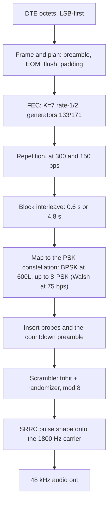

# The transmit chain: the easy half, done right

*Part 2 of "Building a MIL-STD-188-110 HF Modem in Modern C++." Start with the [overview](01-introduction.md), or Part 1, [the rules I build by](02-embedded-cpp-philosophy.md). The code for this article is on GitHub: [kg7hf/modem-core](https://github.com/kg7hf/modem-core/tree/part-2).*

I said at the end of the last piece that the transmitter is the easy half, and I meant it: encoding is deterministic, there is no channel fighting you, and every step is spelled out in the standard. But "easy" is a trap, and it is worth saying why before we start, because it is the reason I hold the transmit side to the same discipline as the hard side.

The transmitter is where interoperability is won or lost. Get one bit-order backwards, seed a scrambler one tap wrong, or number the interleaver rows the way that felt natural instead of the way the standard wrote them, and the waveform still looks fine on a scope and still decodes perfectly... in your own receiver, which made the same mistake. It is the moment another vendor's modem tries to read yours that the truth comes out, and by then the bug is on the air. So the transmitter is the one block where I trust the specification over my instincts, character for character.

It is also the ground truth for everything that follows. The whole receiver, all nine stages of it, is measured against bytes this side produced; the golden vectors that gate every build are transmit output, decoded and compared. Get the transmitter subtly wrong and you have miscalibrated the ruler you measure the hard half with. So the easy half done right is what makes the hard half testable at all.

Here is the journey of one payload, from a handful of user bytes to an 1800 Hz waveform. The whole chain is refreshingly linear, which is the other half of why it is the easy side; each stage hands its output to the next and never looks back.



The waveform is really a family of modes, from 75 bps up to 4800 bps, that all share this chain and differ mostly in how hard they lean on the redundancy stages. Rather than hedge every paragraph across all of them, I will follow one concrete mode the whole way down: **600 bps with the long interleaver, "600L."** It is the one I reach for most, the honest workhorse of HF data: slow enough to survive a rough NVIS path, fast enough to move real traffic, and coded and interleaved heavily enough to show every stage of the chain doing its job. Where another rate does something genuinely different, the low-rate Walsh mode most of all, I will say so. We will take it a stage at a time, and then at the end walk a real two-character message all the way through it in 600L.

## Plan the whole burst before you move a bit

Part 1's first rule was that the signal path allocates nothing while it runs; the transmitter honors it by doing all of its arithmetic up front. Before a single bit is encoded, `body_transmission_plan` sizes the entire transmission: the countdown preamble, the coded body blocks, the end-of-message marker, the coder flush, and the padding that squares off the final interleaver matrix. It returns a plan, not a buffer.

```cpp
struct BodyTransmissionPlan
{
    BodyBlockPlan block{};
    std::size_t    payload_bits{};
    std::size_t    framed_bits{};
    std::size_t    body_blocks{};
    std::size_t    preamble_symbols{};
    std::size_t    transmitted_symbols{};
    std::size_t    audio_samples{};
};

[[nodiscard]] Result<BodyTransmissionPlan>
body_transmission_plan(BodyMode mode, std::size_t payload_bytes) noexcept;
```

The render step then takes that plan, the payload, and a `BodyTransmissionScratch` of caller-owned work buffers, and writes the audio without touching the heap:

```cpp
[[nodiscard]] Status
generate_body_transmission_audio(const BodyTransmissionPlan& plan,
                                 std::span<const std::uint8_t> payload,
                                 BodyTransmissionScratch scratch,
                                 MutableSampleSpan audio) noexcept;
```

Everything the pipeline needs, the framed bits, the coded bits, the interleaver matrix, the scrambled tribits, is a span the caller prepared, sized from the plan. On a workstation that is tidy; on the microcontroller it is the difference between a transmit path you can prove will never fail for memory and one you cannot. The plan is also where `Result` earns its keep from Part 1: an impossible request (a mode and a payload that will not fit the buffers you handed in) comes back as a `Status`, at the door, before any audio exists.

## The FEC: spend bits to buy survival

The first thing that happens to the framed bits is forward error correction, and the whole idea of the low rates is right here: you buy robustness by spending bits on redundancy. The serial-tone body is protected by a **K=7, rate-1/2 convolutional code**, the classic NASA-heritage code with generator polynomials **133 and 171 in octal**. Rate 1/2 means every input bit produces two coded bits; K=7 means the encoder's memory is six bits deep, so each output depends on the last seven inputs, and a decoder can use that overlap to reason its way past errors a memoryless code would swallow.

In code the encoder is a tiny state machine. You push one bit and get back the pair of coded bits it produced, T1 then T2, which is the order the standard serializes them and the order the receiver has to expect:

```cpp
struct EncodedPair { std::uint8_t t1{}; std::uint8_t t2{}; };

class ConvolutionalEncoderK7
{
public:
    explicit constexpr ConvolutionalEncoderK7(std::uint8_t initial_state = 0U) noexcept;
    [[nodiscard]] EncodedPair push(std::uint8_t bit) noexcept;   // generators 133/171 octal
    // ...
};
```

That "T1 before T2" comment is not decoration; it is exactly the sort of convention that has to match on both ends, so it lives next to the code, and the golden test, which pins the whole transmitted symbol stream, fails the moment it flips. The higher rates spend fewer bits on the code and the lower rates spend more, which is the next stage.

## Repetition and Walsh: more redundancy, lower rates

The rate-1/2 code alone carries 600, 1200, or 2400 bits per second of user data over the 2400 symbol-per-second channel, depending on how many bits ride each symbol. To go slower and tougher, you spend the extra room on repetition. At 300 and 150 bps the coded bits are simply repeated, so the receiver can combine several noisy copies into one confident decision; the encoder exposes this directly as `encode_repeated_pairs`. At 75 bps the modem drops to **Walsh orthogonal spreading**, trading almost all of its throughput for a signal that survives conditions the coded rates cannot. And at the top, 4800 bps uncoded, there is no convolutional code at all; it is the one rate that spends nothing on protection and asks the equalizer to do all the work. (The tail-biting punctured variant you will also find in the encoder belongs to the 110B high-rate waveforms, a different family.) One code, four postures, chosen by the mode: plain, repeated, spread, or switched off.

## Interleaving: scatter the damage

Fades on HF are bursty. A codeword hit by a two-hundred-millisecond null is a codeword lost, no matter how strong the code. So between coding and modulation the bits are scattered in time by a block interleaver: a **0.6 second "short"** matrix or a **4.8 second "long"** one. Write the coded bits into the matrix one way, read them out another, and bits that were neighbors in a codeword end up spread across the whole interleaver span on the air. When a fade burst lands, it damages a little of many codewords instead of destroying one, and the error-correction code, which is very good at fixing a few errors spread thin, cleans it up. The long interleaver is why this waveform can ride a five-hertz fade at the low rates: it simply outlasts the null. The cost is latency, four point eight seconds of it, which is the trade you make for a link that does not drop.

## Bits to symbols: the constellation and a Gray map

Now the coded bits become points on the constellation. Here is where the data rate finally shows itself, because the channel is fixed: every mode sends **2400 symbols per second on the one 1800 Hz carrier**, always. What changes with the rate is how many bits you dare to load onto each symbol. The fast modes use the full **8-PSK** circle, three bits per symbol; 1200 bps steps down to QPSK, two bits; and **600L rides BPSK, one bit per symbol**, just two points on opposite sides of the circle. Fewer points sit farther apart, so noise has to push much harder to turn one into another; that is the same robustness the code and the interleaver were buying, spent again in the geometry of the constellation.

The mapping from bits to phase is Gray-coded on purpose: adjacent constellation points differ by exactly one bit, so when noise nudges a symbol into its neighbor, the receiver's most likely error, only one bit flips instead of several. All of it comes from one shared function, `modified_gray_decode`, read the same way by the transmitter and both demappers, with a small table for each width:

```cpp
// MIL-STD-188-110B body-waveform modified-Gray mapping.
// width 3 (8-PSK): the full table.  width 1 (BPSK, 600L): bit 0 -> 0, bit 1 -> 4.
constexpr std::array<std::uint8_t, 8> map{0U, 1U, 3U, 2U, 7U, 6U, 4U, 5U};
```

So in 600L a coded 0 becomes tribit 0, the point at 0 degrees, and a coded 1 becomes tribit 4, the point at 180 degrees. It is a small thing, one array, but it is the kind of small thing that is either right for the whole life of the project or wrong on the air. So it lives in one place, and a `static_assert` pins its derived cases, rather than being retyped wherever a symbol is formed.

(The 75 bps mode is the exception to all of this: instead of mapping bits to a single symbol it spreads each pair of bits across a 32-symbol Walsh sequence, trading almost all of its throughput for orthogonality that survives when even BPSK cannot. It rejoins the chain right after, at the scrambler.)

## Probes and the countdown preamble

A receiver cannot equalize a channel it cannot measure, so the transmitter stitches known symbols into the stream for it. Interspersed **probe** symbols, known values the receiver can predict exactly, are the pilots it uses to keep estimating the channel as it drifts; they are the reason the equalizer in a later article has something to lock to.

And the whole burst opens with the **countdown preamble**. It does two jobs. It announces the mode, so a receiver that had no idea what was coming learns the rate, the interleaver length, everything it needs to configure itself. And it counts down to the data, literally, so a receiver that wakes up in the middle of the preamble, which on a low-power part listening for activity is the normal case, knows exactly how many symbols remain until the payload begins. That countdown is what lets the Cortex-M33 from the overview sleep through dead air and still never miss the start of a message. The transmitter's job is to lay that runway down precisely; the receiver's job, in Part 4, is to find it in noise.

## Scrambling: whiten it, and exactly

The last step before the carrier is the scrambler, and this is the stage where the standard's exact wording matters most. Long runs of identical symbols are bad for a receiver's timing and carrier recovery and bad for the transmitter's spectrum, so the modem adds a known pseudo-random sequence to whiten them. By now the data is tribits on an 8-PSK ring, so the scramble is not an exclusive-or; it is modular addition on the ring:

```cpp
// (tribit + randomizer) mod 8, on the 8-PSK ring
[[nodiscard]] constexpr std::uint8_t tribit_add(unsigned tribit, unsigned randomizer) noexcept
{
    return low_bits<3>(tribit + randomizer);
}
```

The randomizer itself is a linear-feedback shift register (`BodyDataRandomizer`), and it whitens every body symbol, data and probes alike; the preamble gets its own fixed sequence (`SyncRandomizer`), the one the receiver correlates against. Every part of the system that has to agree on these sequences, the transmit mapper, the probe generator, the receiver's reference, adds the randomizer the same way through this one function. That is the single-source discipline from Part 1 aimed at a spec detail: there is exactly one definition of "add the randomizer," so the transmitter and the receiver's idea of the sequence cannot drift apart.

## Turning symbols into 1800 Hz

The symbols are the easy part's last hiding place for real DSP. Each symbol, whichever slice of the constellation the rate uses, is a phase on a single **1800 Hz carrier**, stepped at **2400 symbols per second**, and to put it on the air without splattering into the neighboring spectrum it is shaped by a **square-root raised-cosine** pulse, the matched-filter partner of the shaping the receiver applies coming back. The carrier itself is just a phase that advances a fixed step per sample:

```cpp
// Carrier phase advance per sample: (two_pi * f) / fs, in Real, in the shipped order.
template <HertzSource F> [[nodiscard]] constexpr Real radians_per_sample(F carrier, SampleRate sample_rate) noexcept
{
    return two_pi * static_cast<Real>(carrier.hertz()) / sample_rate.hertz_real();
}

// The carrier-step pin: the exact float the shipped code produced for the body carrier.
static_assert(std::bit_cast<std::uint32_t>(radians_per_sample(Frequency{1800.0, Hz}, SampleRate{48000U})) == 0x3E714639U);
```

That one return statement is where Part 1's rules come home. The carrier and the sample rate arrive as unit types, not bare numbers, so passing a sample rate where the carrier belongs will not even compile; the arithmetic stays in the single `Real` type, so nothing promotes to a software-emulated double on the M33; the operation order is fixed, `two_pi * f` then divide, so the value is bit-for-bit the same on every build; and the `static_assert` under it pins that exact float to its bit pattern, at compile time, because the carrier step is the seed of every sample the transmitter emits and a one-bit drift here is a different waveform. The whole modulator renders straight into the caller's audio span, allocating nothing, which is how the same source that feeds a host WAV file feeds an embedded DAC.

## Walk a message through it

Concrete makes it stick, so let me push the two-character message "Hi" through the chain in 600L. Every value below is what the code actually produces, not an illustration; I ran the real encoder and modulator stages and copied the numbers out.

The transmitter takes user octets **least-significant bit first**. The byte for 'H' is 0x48, so it enters the encoder as the bit sequence:

```
'H' = 0x48 -> 0 0 0 1 0 0 1 0
```

Those bits feed the K=7 encoder one at a time, and each one comes back as a coded pair, t1 then t2. Starting from the all-zero state, the eight bits of 'H' produce:

```
input bit:  0    0    0    1    0    0    1    0
coded pair: 00   00   00   11   01   11   00   01
```

Look at the fourth column. The input bit there is the first 1 in 'H', and it flips both coded bits at once; then its memory keeps coloring the pairs after it, even where the inputs are 0 again. That is the constraint length doing its job. One input bit is smeared across seven coded pairs, fourteen coded bits, which is exactly what lets the receiver rebuild it after the channel eats a few.

Because 600L is BPSK, each coded bit becomes one symbol on its own; there is no gathering into threes. A coded 0 maps to tribit 0 and a coded 1 maps to tribit 4, the two points at 0 and 180 degrees:

```
coded bit 0 -> tribit 0  (0 degrees)
coded bit 1 -> tribit 4  (180 degrees)
```

Interleaving sits between the code and this mapping, and it is the one stage a single-message trace cannot really show on paper: it scatters the coded bits across the whole 4.8 s long-interleaver span, so two bits that were neighbors above end up hundreds of milliseconds apart on the air, and a fade that would have wiped out a run of them instead leaves isolated errors scattered across the codeword.

Last, the scrambler adds its known sequence on the ring before the symbol reaches the carrier. The body randomizer's first tribits are:

```
0  2  4  3  3  6 ...
```

Take a coded 1: it maps to tribit 4, and landing on a randomizer value of 2 it becomes `(4 + 2) mod 8 = 6`. That is the tribit that actually leaves the antenna, at `6 x 45 = 270` degrees. Notice what the whitening just did: BPSK only ever produces tribit 0 or 4, two phases, but after the scrambler adds a value that ranges across the ring the transmitted symbols land anywhere on all eight, which is exactly the point. The spectrum looks full and random even though the data underneath is two-level. The receiver runs the identical randomizer, subtracts the same 2 back off, recovers tribit 4, and reads it as a 1. Nothing about that step is random to the two endpoints; it only looks random on the air, which is all the spectrum needs.

That transmitted tribit is not the end of the line, though; it is a phase. The modulator turns tribit 6 into a point on the 8-PSK circle, `psk8_symbol(6)`, the unit vector at `6 x 45 = 270` degrees:

```
tribit 6 -> I = cos(270) = 0.000,  Q = sin(270) = -1.000   (magnitude 1)
```

Then that point rides the carrier. Each output sample advances the carrier phase by a fixed, test-pinned step of `2*pi*1800/48000 = 0.2356194` radians, which is 13.5 degrees per sample; at 48 kHz one full cycle of the 1800 Hz tone is about 26.7 samples, and each symbol occupies 20 of them. The audio itself is just the real part of the symbol riding that phase, scaled for headroom:

```
audio[n] = scale * Re{ symbol * exp(j * carrier_phase[n]) }
```

To see it, hold tribit 6 steady and the modulator emits a clean 1800 Hz sinusoid sitting at that 270-degree offset. These are eight consecutive samples the modem actually produces, climbing to a crest and turning over:

```
n=241  n=242  n=243  n=244  n=245  n=246  n=247  n=248
0.126  0.244  0.349  0.435  0.497  0.531  0.536  0.511
```

That is the 1800 Hz carrier, one sample every 13.5 degrees, its amplitude held under the `0.98` no-clip ceiling the modulator derives from its own pulse. In live traffic the phase hops every 20 samples as the tribits change (for 600L the data only ever picks tribit 0 or tribit 4, and the scrambler spreads those picks across all eight phases), and the square-root raised-cosine pulse rounds each hop so the burst stays inside its slice of spectrum; but the machinery is exactly this. Symbols are phases, phases become samples, samples become the tone on the wire.

That is the whole idea of the transmit chain in one message. Every value here is deterministic, reproducible, and defined in exactly one place, so a receiver doing each step in reverse, our own or an independent one, lands back on the bytes "Hi".

## Why the easy half still earns the rigor

Step back and the transmit chain is short: plan, encode, repeat, interleave, map or spread, probe, scramble, shape. None of it is hard the way undoing a fading channel is hard. But every stage is a place where a detail the standard fixed can be gotten subtly wrong in a way no amount of testing against your own receiver will ever reveal, because your own receiver shares the mistake.

That is why I treat it as ground truth and not as a warm-up. The bytes this side produces are the reference the whole receiver is measured against; they are the golden vectors, and they are what an independent implementation decodes when it decodes ours at all. The discipline is not there because the transmitter is hard. It is there because the transmitter is the one thing in the system that has to be exactly right for anyone else to be able to talk to you, and "exactly right" is a property you keep by building it once, carefully, from the specification, and then never letting it drift.

## Go read the code, and the standard

A modem's real lesson is not the DSP; it is learning to read a specification and confirm the code does what it says. The code is on GitHub at [kg7hf/modem-core](https://github.com/kg7hf/modem-core/tree/part-2), and its [start-here page](https://github.com/kg7hf/modem-core/blob/part-2/docs/start-here.md) maps it stage by stage. MIL-STD-188-110 is public (pull it from EverySpec or the DoD's ASSIST site). It is written in "shall" statements, with the exact numbers living in its tables and figures. Several questions below put you in both windows at once, the standard and the source, to find a requirement and check that the implementation honors it. That habit is the daily work of mission-critical engineering.

1. What carrier frequency and symbol rate does this waveform use, and where are they set? One search; they are named constants, not magic numbers.
2. The standard gives the K=7 code's generator polynomials in **octal**: 133 and 171. The code stores them as `0x6D` and `0x4F`. Convert 133 and 171 to hex yourself; you will get `0x5B` and `0x79`, which do *not* match. Work out what the code did, and why. (Which end of the shift register feeds the taps?) This is the kind of mismatch that looks like a bug and isn't.
3. The end-of-message marker is a specific 32-bit word. Find it in the code (a single hex literal), then find where the standard specifies it, and check it bit for bit. Why would a wrong EOM word pass every one of your own tests and only surface when another vendor's modem reads your signal?
4. The body data randomizer is a 12-bit shift register. MIL-STD-188-110B Figure 6 draws it, including the value it is loaded with at the start of every burst; the code even cites the page. Find the initial load in the code and confirm it against the figure. (Write `0xBAD` in binary. Memorable, isn't it?)
5. The 8-PSK modified-Gray mapping is a table in the standard (MIL-STD-188-110B section 5.3.2.3.6, Tables XII and XIII). The code carries it as an eight-entry array. Rebuild the table from the standard, check every entry against the array, then confirm the one-bit-between-neighbors property the Gray code is there to provide.
6. 600L rides BPSK, one bit per symbol; 2400 bps rides full 8-PSK, three. Find the single place that decides how many bits ride each symbol, and tie 600, 1200, and 2400 bps each back to the modulation the standard calls for at that rate.
7. The interleaver is a rows-by-columns matrix: you load it one way and read it another. Find the matrix geometry in the code, match it against the dimensions the standard gives for the 4.8 second interleaver, and trace how two bits that were neighbors going in end up seconds apart on the air.
8. A receiver cannot equalize a channel it cannot measure. Find where the transmitter builds the countdown preamble and stitches probe symbols into the data. What is the countdown counting down to, and why does a battery-powered receiver care about it?
9. The article claims the signal path allocates nothing. Do not take my word for it: start at `generate_body_transmission_audio` and prove it. Show every buffer came from the caller, find the one place all the sizing is decided, and find the `Result` that turns away an impossible request at the door.
10. The transmitter is the ground truth the whole receiver is measured against, which only holds if it is bit-for-bit reproducible. The carrier step is `(two_pi * f) / fs`. Predict, in float, whether rewriting it as `two_pi * (f / fs)` changes a single output sample, *before* you test it. Then find one more place where the order of a floating-point operation is pinned on purpose, and say what a re-order would cost. This is why the standard's tables are exact integers and the code pins its one derived float.

If that last one got its hooks in you, you are ready for the hard half. The headers in [the repository](https://github.com/kg7hf/modem-core/tree/part-2) already declare a body decoder, a Viterbi decoder, a soft demapper, and a carrier tracker that it does not yet implement. Read their design notes and ask: from the transmitter alone, what is the very first thing the receiver has to undo?

## Next

With clean symbols on the air, next week I cross to the hard side and start undoing the channel: the audio front end, matched filtering and symbol timing recovery, where the receiver first has to figure out where a symbol even is.
