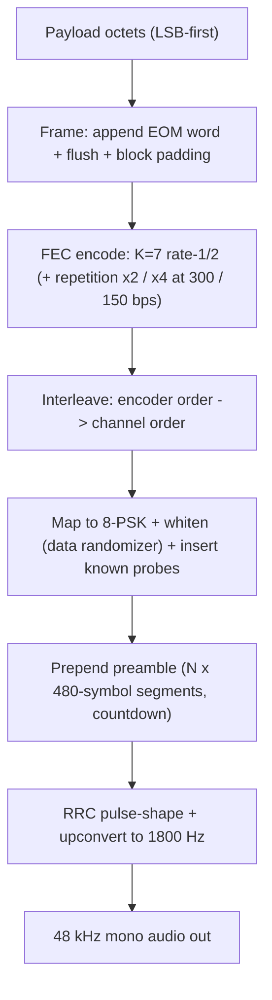
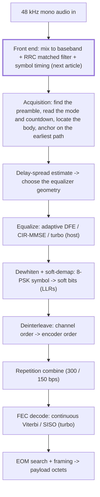

# Start here

This repository is the transmit side of a MIL-STD-188-110A/B serial-tone HF modem:
everything between a message and the audio a radio puts on the air. This page is the
map. It shows the big picture, walks the transmit chain in the order the data flows,
lists which file does what, and suggests a reading order. It closes with a look ahead
at the receiver's first stage, the subject of the next article.

The worked example throughout the series is 600 bps with the long interleaver ("600L").
[`tests/tx_demo.cpp`](../tests/tx_demo.cpp) walks a short message through that mode and
prints the values at each step; build it (see the [README](../README.md)) and keep its
output beside you.

## The big picture: bytes to audio

Every stage exists so that a receiver can undo what the channel will do to the signal.
The code adds redundancy; the interleaver turns a fade into scattered errors the code
can fix; the probes give the receiver known symbols to measure the channel with; and
the preamble tells it that a transmission is starting, and in which mode.

## Guided tour: the transmit chain

Follow the diagram top to bottom. The transmitter is a thin orchestrator over the body
waveform module, and every buffer it touches belongs to the caller.

1. **Plan and orchestrate.** Size the whole transmission up front, then run the chain
   into the caller's audio buffer.
   → [transmitter explainer](../modem/m110a/transmitter-and-dsp-explainer.md) ·
   [`transmitter.cpp`](../modem/m110a/transmitter.cpp)
2. **Frame.** Append the 32-bit end-of-message (EOM) word and the 144-bit flush, then
   pad to a whole number of blocks.
   → [body waveform explainer](../modem/m110a/body-waveform-and-scrambler-explainer.md) ·
   [`body_waveform.cpp`](../modem/m110a/body_waveform.cpp)
3. **FEC encode.** The K=7, rate-1/2 convolutional encoder, with repetition at 150 and
   300 bps; one continuous encoder runs across every block.
   → the worked example in the body waveform explainer ·
   [`convolutional_k7.cpp`](../modem/common/fec/convolutional_k7.cpp)
4. **Interleave.** The standard's matrix interleaver: load it one way, read it out
   another, so a fade on the air lands as scattered bits in the code.
   → [demapper and deinterleaver explainer](../modem/m110a/demapper-and-deinterleaver-explainer.md) ·
   [`interleaver.cpp`](../modem/m110a/interleaver.cpp)
5. **Map, whiten, and insert probes.** Bits become points on the 8-PSK circle through a
   modified-Gray map; the data randomizer whitens every body symbol; known probe
   symbols are inserted into every frame.
   → the body waveform and demapper explainers ·
   [`demapper.cpp`](../modem/m110a/demapper.cpp),
   [`scrambler.cpp`](../modem/m110a/scrambler.cpp),
   [`body_waveform.cpp`](../modem/m110a/body_waveform.cpp)
6. **Preamble and render.** Prepend the countdown preamble, shape every symbol with a
   root-raised-cosine pulse, and up-convert to the 1800 Hz carrier.
   → the body waveform explainer, and section 8 of the transmitter explainer ·
   [`body_waveform.cpp`](../modem/m110a/body_waveform.cpp),
   [`timing_recovery.cpp`](../modem/common/dsp/timing_recovery.cpp) (the pulse)

Underneath every stage sit the mode tables in
[`modem/common/waveform/`](../modem/common/waveform/), the single authority on what each
rate and interleaver setting looks like, and the shared vocabulary in
[`modem/common/`](../modem/common/): the one scalar type `Real`, the unit types, and the
`Status` and `Result` error values.

## Module map

What ships today, and where each piece is explained.

| Stage or role | Source, under `modem/` | Explained in |
|---|---|---|
| Transmit orchestration | `m110a/transmitter.*` | transmitter explainer |
| Body burst: block plan, preamble, encode, framing, render | `m110a/body_waveform.*` | body waveform explainer |
| Scramblers and the modified-Gray map | `m110a/scrambler.*` | body waveform explainer |
| 8-PSK mapping | `m110a/demapper.*` | demapper and deinterleaver explainer |
| Interleaver | `m110a/interleaver.*` | demapper and deinterleaver explainer |
| K=7 convolutional encoders | `common/fec/convolutional_k7.*` | body waveform explainer (worked example) |
| Mode tables | `common/waveform/waveform.*` | body waveform explainer |
| Root-raised-cosine pulse | `common/dsp/timing_recovery.*` | transmitter explainer, section 8 |
| Shared vocabulary: `Real`, units, status and results, bit spans | `common/*`, `common/units/*` | the comments in each header |

The demo and the golden-waveform test are [`tests/tx_demo.cpp`](../tests/tx_demo.cpp);
[CONTRIBUTING](../CONTRIBUTING.md) covers the quality gates. Where the standard left a
decision to the implementer, the call made is recorded in
[standard interpretations](../modem/m110a/standard-interpretations.md).

The headers also declare the receiver's functions (the demappers, the deinterleavers,
the Viterbi decoders, the body decoder, the matched filter and timing loop, the carrier
tracker) with their design notes. They are not implemented yet; they arrive with the
receiver articles.

## Reading order

1. **This page**, then build and run `tx_demo` and keep its output open.
2. The [transmitter explainer](../modem/m110a/transmitter-and-dsp-explainer.md), then
   [`transmitter.cpp`](../modem/m110a/transmitter.cpp): short and linear, one function
   to plan and one to render.
3. The [body waveform explainer](../modem/m110a/body-waveform-and-scrambler-explainer.md):
   the burst structure and the block plan that sizes everything. Read it early; every
   other stage is framed by it.
4. The [demapper and deinterleaver explainer](../modem/m110a/demapper-and-deinterleaver-explainer.md):
   how the coded bits are shuffled and placed on the constellation.
5. The [standard interpretations](../modem/m110a/standard-interpretations.md): the
   judgment calls.

Each explainer follows a common shape: a 50,000-foot view, a 5th-grade version, where
the module sits in the pipeline, a function-by-function walkthrough, a small worked
example (illustrative, not a compliance trace), what goes wrong, what to watch while
debugging, and notes for maintainers.

Then do what the [transmit-chain article](articles/03-transmit-chain.md) asks: open the
standard beside the code and check the numbers yourself.

## Next: the audio front end

The transmitter is the easy half; everything about its signal is known in advance. The
receiver starts with none of that. Here is the receive chain at the level the
introduction describes it; the next article starts at the top.

The front end has four jobs. It mixes the 1800 Hz carrier down to complex baseband; it
filters with a root-raised-cosine pulse, the same family of pulse the transmitter
shaped with; it works out where each symbol actually is; and it keeps tracking
the small carrier offset that two radios always leave between them.

Some of that is already here. The pulse is implemented, because the transmitter shapes
every symbol with it: `make_root_raised_cosine_taps` in
[`timing_recovery.cpp`](../modem/common/dsp/timing_recovery.cpp). The receive side is
declared in [`timing_recovery.hpp`](../modem/common/dsp/timing_recovery.hpp):
`matched_filter_and_recover_timing`, with its `TimingRecoveryConfig` and
`TimingRecoveryProgress`, and the `CarrierTracker`. Read the declarations and their
comments, and think about these before the next article:

1. The transmitter shapes with a root-raised-cosine pulse. Why does the receiver filter
   with the same family of pulse, and what would filtering with anything else cost?
2. The transmitter and the receiver run on different crystals. Over the 9.6-second
   600L burst that `tx_demo` renders, what happens to "where is the symbol?", and what
   does a timing loop have to keep doing about it?
3. The transmitter's pulse uses a rolloff of 0.25 (`shaping_rolloff` in
   [`body_waveform.cpp`](../modem/m110a/body_waveform.cpp)). Does the receiver's filter
   have to use the same rolloff? What would a wider one buy, and what would it cost?
